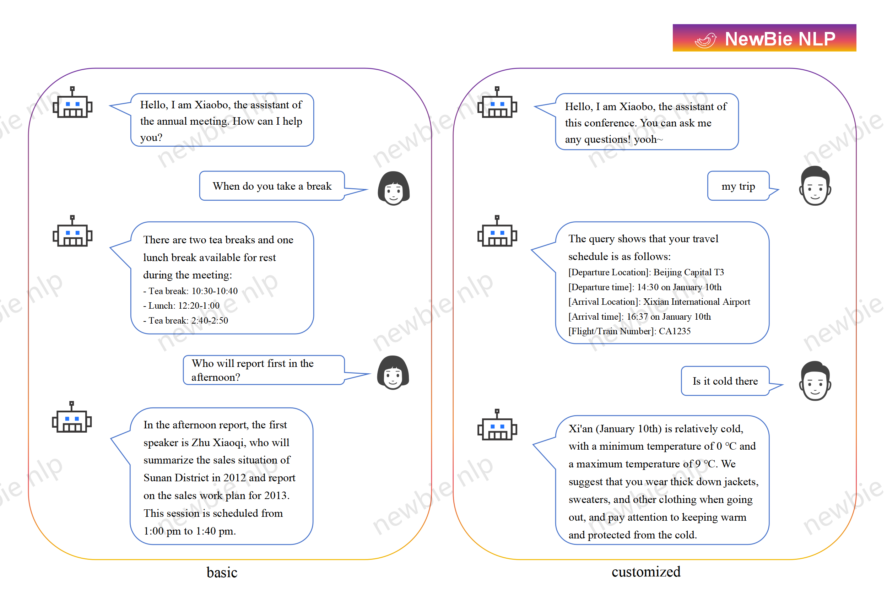

# Conference Assistant    
  
<h4 align="center">
    <p>
        <a href="#-create-your-exclusive-conference-assistant">🤖 create</a> |
        <a href="#-quickly-chat-with-your-assistant">💫 chat</a> |
        <a href="#-start-a-more-powerful-chat">💥 enhance</a> |
        <a href="#-personalized-customization">🤝 customize</a> |
        <a href="#-license">🏷 license</a> 
    <p>
</h4>  

[English](README.md) | [中文](./README_zh.md)  
A conference assistant based on the LLMs, which can be used for various types of conferences such as company annual meetings and academic conferences. It is very easy to use, just provide the meeting documents.  
Include but are not limited to the following purposes:
- Basic information of the meeting
- Specific agenda
- Hotel and itinerary arrangement
- Other precautions  
## 🤖 create your exclusive conference assistant
You need to specify the name of the company, school, or organization, and you can also add some instructions to restrict or optimize the assistant's responses.   
```python 
from assistant import LLMAssistant

# Assistant Settings.
firm = 'CITIC Guoan Industrial Group Co., Ltd' 
instruction = '' 
model = 'qwen-max'

# Conference Information.
file_path = ['./data/agenda_example.xlsx'] 
        
# Create Conference Assistant.
my_assistant = LLMAssistant(firm=firm, instruction=instrction, file_path=file_path, model=model)
```  
You need to specify the large language model used by the assistant. We follow the OpenAI SDK, and currently support the following models: qwen、kimi、spark. If there are many documents, it is recommended to use a model that supports longer context input.  
```python
# Add your api_key to the environment variables.
import os
os.environ['API_KEY'] = 'sk-XXXXXXXXXXXXXXXXXXXXXXXXXXXXXXXX'

# Support the following models:
# qwen: qwen-plus, qwen-max  
# kimi: moonshot-v1-8k, moonshot-v1-32k  
# spark: generalv3.5  
``` 
You need to provide additional conference documents, and the assistant will learn and answer based on the content of these documents. We currently support a variety of file formats, including *.doc*, *.docx*, *.xls*, *.xlsx*, *.txt*, *.csv*, *.tsv*, and more. However, we recommend using <mark>*.xlsx*</mark> or <mark>*.csv*</mark> formats for optimal results.   
```python
# Check the conference content used by the assistant.
content = my_assistant.conference_info()
print('conference content: ', content)
```
## 💫 quickly chat with your assistant
Quickly initiate chat, support streaming and non streaming, default streaming.
```python 
# Start a Chat.
query = 'What should I call you?'
stream = False

answer = ''
for chunk in my_assistant.single_chat(query=query, stream=stream):
    answer += chunk
print('answer:', answer)
```
## 💥 start a more powerful chat
By combining historical session information, the assistant can fully understand each query and answer more accurately.  
When chatting, you need to specify a session ID to manage session information and specify the session rounds that the assistant should consider when answering.
```python 
# Start a Chat.
session_id = '20250108001'
query = 'What should I call you?'
stream = True
rounds = 3

answer = ''
for chunk in my_assistant.chat(session_id=session_id, query=query, stream=stream, rounds=rounds):
    answer += chunk
print('answer:', answer)
```
Multiple rounds of session require middleware to store and manage session information. Please change your Redis configuration in the <mark>*config.py*</mark> as shown below:      
```python  
redis_config = {
    'host':'127.0.0.1',
    'port':'7001',
    'password':'xxxxxxxxx'
}
```
Manage historical information through session ID.  
```python
history = my_assistant.history_info(session_id)
print('session history: ', history)
```
## 🤝 personalized customization
  
You can also explore additional customized developments triggered through natural language. If you have any needs in this area, please feel welcome to contact us:  
- email : zhenhu317@gmail.com  
## 🏷 license
Conference Assistant is licensed under the [Apache-2.0 License](./LICENSE). 