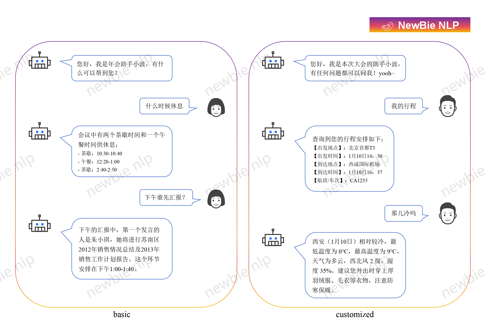

# 会议助手    
  
<h4 align="center">
    <p>
        <a href="#-创建助手">🤖 创建助手</a> |
        <a href="#-快速开始">💫 快速开始</a> |
        <a href="#-对话增强">💥 对话增强</a> |
        <a href="#-个性化定制">🤝 个性化定制</a> |
        <a href="#-开源协议">🏷 开源协议</a> 
    <p>
</h4>  

[English](README.md) | [中文](./README_zh.md)  
基于大语言模型（LLMs）的会议助手，适用于公司年会、学术研讨会等多种类型的会议。该助手使用非常简便，仅需提供会议相关文档即可启动服务。包括但不限于以下用途：  
- 会议基本信息
- 具体议程安排
- 酒店与行程预订
- 其他注意事项
## 🤖 创建助手
您需要指定您的公司、学校或组织的名称，并且可以添加一些指令来限制或优化助手的回复。  
```python 
from assistant import LLMAssistant

# 助手配置
firm = '中信国安实业集团有限公司' 
instruction = '' 
model = 'qwen-max'

# 会议信息
file_path = ['./data/agenda_example.xlsx'] 
        
# 实例化
my_assistant = LLMAssistant(firm=firm, instruction=instrction, file_path=file_path, model=model)
```  
您需要指定助手所使用的大语言模型。我们遵循 OpenAI 的 SDK，目前支持以下模型： Qwen、Kimi、Spark 。如果会议文档较多，建议您使用支持更长上下文输入的模型。    
```python
# 在环境变量中添加您的第三方llm api_key
import os
os.environ['API_KEY'] = 'sk-XXXXXXXXXXXXXXXXXXXXXXXXXXXXXXXX'

# 支持以下大语言模型
# qwen: qwen-plus, qwen-max  
# kimi: moonshot-v1-8k, moonshot-v1-32k  
# spark: generalv3.5  
``` 
您需要提供额外的会议文档，助手将基于这些文档的内容进行学习并作答。我们目前支持多种文件格式，包括 *.doc*, *.docx*, *.xls*, *.xlsx*, *.txt*, *.csv*, *.tsv* 等。 推荐使用 <mark>*.xlsx*</mark> 或者 <mark>*.csv*</mark> 。  
```python
# 检查助手使用的会议信息
content = my_assistant.conference_info()
print('conference content: ', content)
```
## 💫 快速开始
快速发起聊天，支持流式和非流式传输，默认为流式传输。  
```python 
# 开始对话
query = '你叫什么名字？'
stream = False

answer = ''
for chunk in my_assistant.single_chat(query=query, stream=stream):
    answer += chunk
print('answer:', answer)
```
## 💥 对话增强
结合历史会话信息，助手能够全面理解每一个问题，从而提供更加准确的回答。在聊天时，您需要指定一个会话ID来管理会话信息，并明确助手在回答问题时应考虑的会话轮次。  
```python 
# 开始对话
query = '你叫什么名字？'
stream = True
rounds = 3

answer = ''
for chunk in my_assistant.chat(query=query, stream=stream, rounds=rounds):
    answer += chunk
print('answer:', answer)
```
多轮次会话需要中间件来存储和管理会话信息。请按照如下所示，在 <mark>*config.py*</mark> 中更改您的 Redis 配置：      
```python  
redis_config = {
    'host':'127.0.0.1',
    'port':'7001',
    'password':'xxxxxxxxx'
}
```  
您可以通过会话id来管理会话信息:  
```python
history = my_assistant.history_info(session_id)
print('session history: ', history)
```   
## 🤝 个性化定制
  
您还可以探索通过自然语言触发的其他定制化开发。若您在这一方面有任何需求，欢迎随时联系我们： 
- 邮箱: zhenhu317@gmail.com  
## 🏷 开源协议
会议助手遵从[Apache-2.0 License](./LICENSE). 